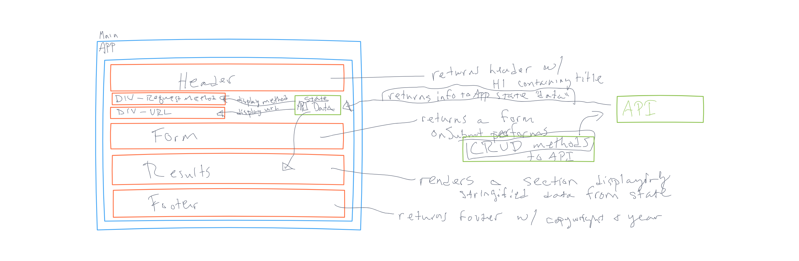

# **RESTy**

## **Problem Domain**

a Counter application. With the following attributes

- `Header`, `Footer`, and `Counter` components to separate files
- Properly `export` them as defaults
- Import them into the `App` Component using ES6 `import` statement
- Proper state management
- Button Handlers
  <!-- - Bonus if they can wire both buttons with one handler -->

The application has the following features:

- Simple, intuitive user interface
  - A form where a user:  
    - Enters a REST API Endpoint (URI)
    - Selects the REST Method to use (get, post, put, delete)
    - For put and post, allow the user to enter JSON to be used as the body for the request
    - A button to initiate the request
- An output section which:
  - Displays a spinner to indicate a request is in process
  - Once a request is complete:
    - Hide the spinner
    - Display a well formatted view of the API response in 2 sections
      - Headers
      - Body
- A history section which:
  - Shows a list of all unique, successful requests
  - Allows a user to click or select one to re-populate the form so they can repeat the request

## **UML**

